<div align="center">

# Hi there, I'm Ezzat Makar 👋


[](https://ezzatmakar.vercel.app)
[](https://www.linkedin.com/in/ezzat-makar)
[](mailto:ezzatmakar93@gmail.com)


</div>

---

## 🚀 About Me

```javascript
const ezzat = {
    pronouns: "He" | "Him",
    location: "🌍 Building from anywhere",
    code: ["PHP", "JavaScript", "TypeScript", "SQL"],
    askMeAbout: ["web dev", "backend architecture", "API design", "database optimization"],
    technologies: {
        backEnd: {
            php: ["Laravel", "WordPress"],
            js: ["Node.js", "NestJS", "Express"],
        },
        frontEnd: {
            js: ["React", "Vue.js"],
            css: ["Bootstrap", "Tailwind"]
        },
        databases: ["MySQL", "PostgreSQL", "MongoDB", "Redis"],
        misc: ["REST APIs", "Swagger", "Git", "Docker"]
    },
    currentFocus: "Building scalable distributed systems",
    funFact: "I debug with console.log and I'm not ashamed 🐛"
};
```

<details>
<summary>📖 More about me</summary>
<br>

I'm a passionate **Full-Stack Software Engineer** dedicated to crafting **scalable, maintainable, and high-performance web applications** that solve real-world problems. With expertise spanning both backend architecture and frontend development, I thrive in building end-to-end solutions that deliver exceptional user experiences.

**What drives me:**
- 🎯 **Problem Solver** — I love tackling complex technical challenges and finding elegant solutions
- 🏗️ **System Architect** — Designing robust, scalable systems that stand the test of time
- 💡 **Continuous Learner** — Always exploring new technologies and best practices
- 🤝 **Collaborative Developer** — Strong believer in clean code, code reviews, and knowledge sharing
- 🌍 **Impact-Focused** — Building applications that make a tangible difference

> *"Code is like humor. When you have to explain it, it's bad." — Cory House*

</details>

---

## 🛠️ Tech Arsenal

<div align="center">

<table>
<tr>
    <td align="center" width="96">
        
        <br>PHP
    </td>
    <td align="center" width="96">
        
        <br>Laravel
    </td>
    <td align="center" width="96">
        
        <br>Node.js
    </td>
    <td align="center" width="96">
        
        <br>NestJS
    </td>
    <td align="center" width="96">
        
        <br>Express
    </td>
    <td align="center" width="96">
        
        <br>TypeScript
    </td>
    <td align="center" width="96">
        
        <br>JavaScript
    </td>
</tr>
<tr>
    <td align="center" width="96">
        
        <br>React
    </td>
    <td align="center" width="96">
        
        <br>Vue.js
    </td>
    <td align="center" width="96">
        
        <br>HTML5
    </td>
    <td align="center" width="96">
        
        <br>CSS3
    </td>
    <td align="center" width="96">
        
        <br>Bootstrap
    </td>
    <td align="center" width="96">
        
        <br>Tailwind
    </td>
    <td align="center" width="96">
        
        <br>jQuery
    </td>
</tr>
<tr>
    <td align="center" width="96">
        
        <br>MySQL
    </td>
    <td align="center" width="96">
        
        <br>PostgreSQL
    </td>
    <td align="center" width="96">
        
        <br>MongoDB
    </td>
    <td align="center" width="96">
        
        <br>Redis
    </td>
    <td align="center" width="96">
        
        <br>SQLite
    </td>
    <td align="center" width="96">
        
        <br>Git
    </td>
    <td align="center" width="96">
        
        <br>WordPress
    </td>
</tr>
</table>

</div>

---

## 🌱 Currently Leveling Up


```typescript
const currentGoals2025 = {
    learning: [
        "🎯 Advanced TypeScript patterns",
        "🏗️ Microservices architecture",
        "☁️ Cloud platforms (AWS/GCP)",
        "🐳 Docker & Kubernetes"
    ],
    building: [
        "Scalable distributed systems",
        "Event-driven architectures",
        "High-performance APIs"
    ],
    contributing: [
        "Open-source projects",
        "Tech community"
    ]
};
```

<br clear="right"/>

---

## 📊 GitHub Analytics

<div align="center">
  
  
</div>

<div align="center">
  
</div>

<div align="center">
  
</div>

---

## 🏆 Achievements & Highlights

<div align="center">

| 🎯 Metric | 📊 Stats |
|-----------|----------|
| 💻 Years of Experience | 3+ Years |
| 🚀 Projects Delivered | 20+ |
| ⭐ GitHub Stars | Growing |
| 🤝 Collaborations | Always Open |

</div>

---

## 💡 My Development Workflow

```mermaid
%%{init: {'theme':'dark'}}%%
graph TB
    A[💡 Idea] --> B[📋 Planning]
    B --> C[🎨 Design]
    C --> D[💻 Development]
    D --> E[🧪 Testing]
    E --> F{✅ Passed?}
    F -->|No| D
    F -->|Yes| G[🚀 Deployment]
    G --> H[📊 Monitoring]
    H --> I[🔄 Iterate]
    I --> B
    
    style A fill:#a855f7
    style G fill:#10b981
    style F fill:#f59e0b
```

<div align="center">



</div>

---

## 📈 Contribution Graph

<div align="center">
  
[](https://github.com/ezzatmakar)

</div>

---

## 🎯 What I Bring to the Table

<table>
<tr>
<td width="50%" valign="top">

### 🎨 Frontend Development
- ✅ Pixel-perfect, responsive UI
- ✅ Modern component architecture
- ✅ Performance optimization
- ✅ Cross-browser compatibility
- ✅ Accessibility best practices
- ✅ State management (Redux, Vuex)
- ✅ Progressive Web Apps (PWA)

</td>
<td width="50%" valign="top">

### ⚙️ Backend Development
- ✅ RESTful API design
- ✅ Database optimization
- ✅ Authentication & security
- ✅ Caching strategies
- ✅ Clean code & SOLID principles
- ✅ Microservices architecture
- ✅ Real-time applications

</td>
</tr>
</table>

---

## 🎮 When I'm Not Coding

 Learning new technologies  
🎯 Contributing to open source  
📚 Reading tech blogs & documentation  
☕ Drinking coffee & debugging  
🎵 Listening to music while coding  

---

## 💬 Random Dev Quote

<div align="center">


</div>

---

## 🐍 Contribution Snake

<div align="center">
  


</div>

---

## 📫 Let's Connect & Build Something Amazing!

<div align="center">

💼 **Open to exciting opportunities and collaborations!**

<br>

[](https://ezzatmakar.vercel.app)
[](https://www.linkedin.com/in/ezzat-makar)
[](mailto:ezzatmakar93@gmail.com)
[](https://github.com/ezzatmakar)

<br>

**💡 Interested in:**
- 🚀 Full-time opportunities
- 🤝 Freelance projects
- 💬 Tech discussions
- 🌟 Open-source collaborations

</div>

---

<div align="center">

### ⭐️ *"First, solve the problem. Then, write the code."* – John Johnson

**Thanks for stopping by! Let's build something incredible together** ✨

<picture>
  <source media="(prefers-color-scheme: dark)" srcset="github-snake-dark.svg" />
  <source media="(prefers-color-scheme: light)" srcset="github-snake.svg" />
  
</picture>

</div>

---

<div align="center">

### ⭐️ *"First, solve the problem. Then, write the code."* – John Johnson

**Thanks for stopping by! Let's build something incredible together** ✨


</div>
